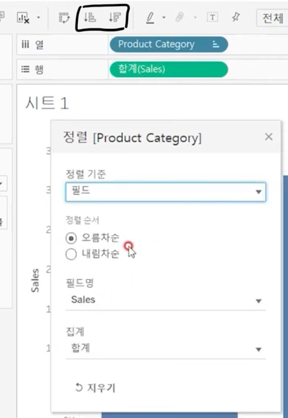
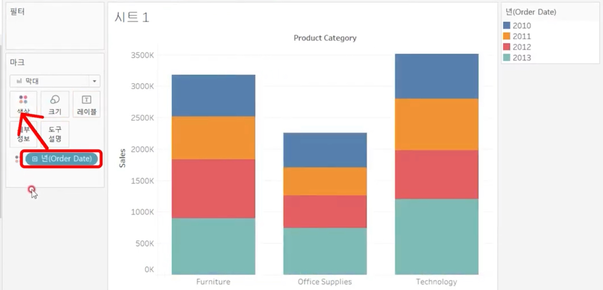
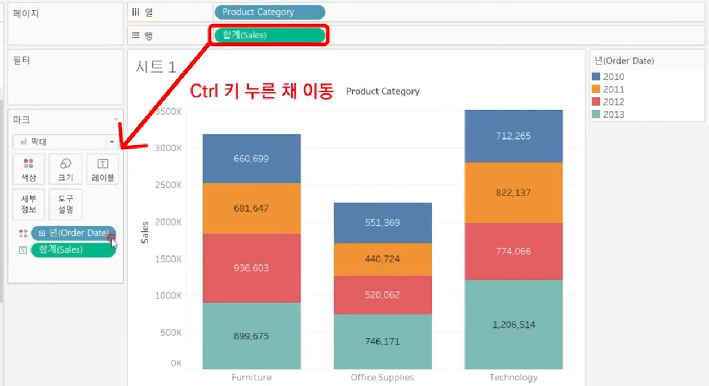
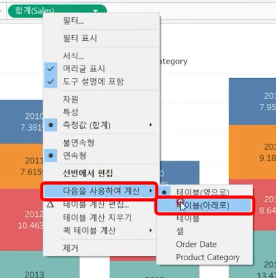
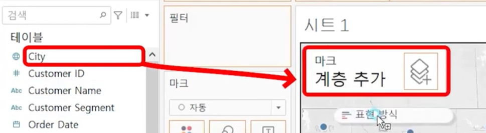
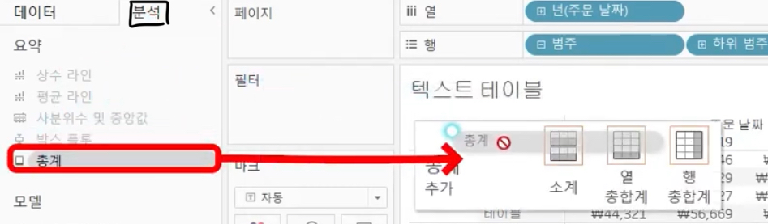
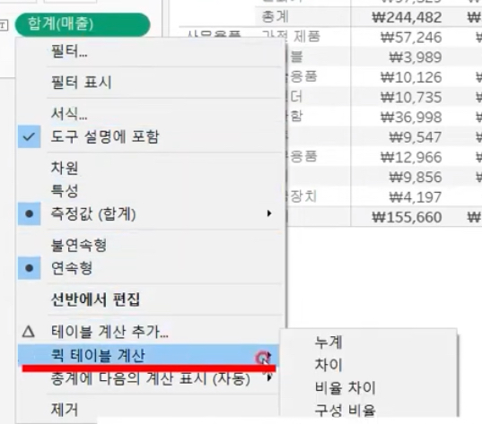
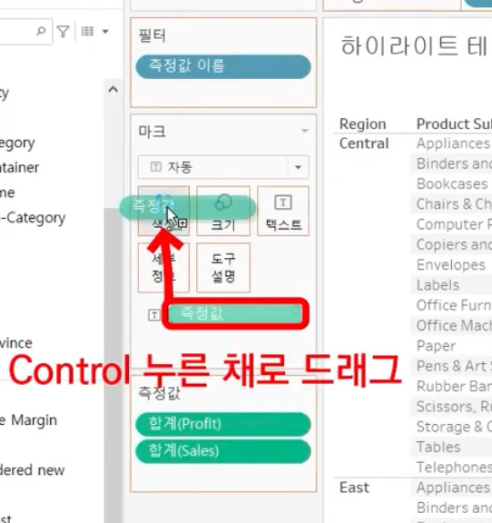
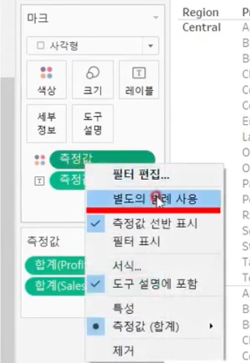

# Second Study Week

- 10강: [차원과 측정값](#10강-차원과-측정값)

- 11강: [시각화](#11강-시각화)

- 12강: [막대그래프](#12강-막대그래프)

- 13강: [누적막대그래프](#13강-누적막대그래프)

- 14강: [병렬막대그래프](#14강-병렬막대그래프)

- 15강: [누적병렬막대그래프](#15강-누적병렬막대그래프)

- 16강: [라인그래프](#16강-라인그래프)

- 17강: [맵작성](#17강-맵작성)

- 18강: [텍스트테이블](#18강-텍스트테이블)

- 19강: [트리맵과 하이라이트테이블](#19강-트리맵과-하이라이트테이블)

- 문제1 : [문제1](#문제1)

- 문제2 : [문제2](#문제2)

- 참고자료 : [참고자료](#참고-자료)


## Study Schedule

| 강의 범위     | 강의 이수 여부 | 링크                                                                                                        |
|--------------|---------|-----------------------------------------------------------------------------------------------------------|
| 1~9강        |  ✅      | [링크](https://youtu.be/3ovkUe-TP1w?si=CRjj99Qm300unSWt)       |
| 10~19강      | ✅      | [링크](https://www.youtube.com/watch?v=AXkaUrJs-Ko&list=PL87tgIIryGsa5vdz6MsaOEF8PK-YqK3fz&index=75)       |
| 20~29강      | 🍽️      | [링크](https://www.youtube.com/watch?v=AXkaUrJs-Ko&list=PL87tgIIryGsa5vdz6MsaOEF8PK-YqK3fz&index=65)       |
| 30~39강      | 🍽️      | [링크](https://www.youtube.com/watch?v=e6J0Ljd6h44&list=PL87tgIIryGsa5vdz6MsaOEF8PK-YqK3fz&index=55)       |
| 40~49강      | 🍽️      | [링크](https://www.youtube.com/watch?v=AXkaUrJs-Ko&list=PL87tgIIryGsa5vdz6MsaOEF8PK-YqK3fz&index=45)       |
| 50~59강      | 🍽️      | [링크](https://www.youtube.com/watch?v=AXkaUrJs-Ko&list=PL87tgIIryGsa5vdz6MsaOEF8PK-YqK3fz&index=35)       |
| 60~69강      | 🍽️      | [링크](https://www.youtube.com/watch?v=AXkaUrJs-Ko&list=PL87tgIIryGsa5vdz6MsaOEF8PK-YqK3fz&index=25)       |
| 70~79강      | 🍽️      | [링크](https://www.youtube.com/watch?v=AXkaUrJs-Ko&list=PL87tgIIryGsa5vdz6MsaOEF8PK-YqK3fz&index=15)       |
| 80~89강      | 🍽️      | [링크](https://www.youtube.com/watch?v=AXkaUrJs-Ko&list=PL87tgIIryGsa5vdz6MsaOEF8PK-YqK3fz&index=5)        |


<!-- 여기까진 그대로 둬 주세요-->
<!-- 이 안에 들어오는 텍스트는 주석입니다. -->

# Second Study Week

## 10강: 차원과 측정값

<!-- 차원과 측정값에 관해 배우게 된 점을 적어주세요 -->
- 태블로는 데이터를 원본에 연결하는 경우 데이터의 열을 필드로 만들고 유형에 따라 필드를 차원 또는 측정값으로 할당
- 위가 차원(파란색), 아래가 측정값(초록색)
- 필드 변경 가능


> **🧞‍♀️ 차원과 측정값의 고유한 특성에 대해 설명해주세요.**

```
차원: 정성적인 값(이름, 카테고리와 같이 집계되거나 계산되지 않는 독립적인 필드) -> 불연속형 필드, 연속형 필드(날짜)
측정값: 정량적인 수치값(매출, 수익, 수령등 집계될 수 있는 값)
-> 연속형 필드
```

*Quiz: 차원은 불연속형이고, 측정값은 연속형이다 (o, x) -> X* 


## 11강: 시각화

<!-- 시각화 관해 배우게 된 점을 적어주세요 -->

- 표현방식 클릭해서 여러 방법으로 시각화 가능
- 더블클릭 또는 선반에 직접 추가 또는 한 필드를 클릭한 채로 ctrl키를 누르고 다른 필드를 선택해서 시트로 바로 추가 세가지 방법으로 시각화 가능
+마크창도 활용 가능


*Quiz: 차원은 대부분 불연속형이며 표 형태로 시각화했을 때 머리글로 표시되고, 측정값은 대부분 연속형이므로 표 형태로 시각화 진행했을 때 패널로 추가된다.(o, x) -> O*

## 12강: 막대그래프

<!-- 막대그래프에 관해 배우게 된 점을 적어주세요 -->

- 빠른 메뉴 버튼이나 수동으로 설정 가능
- 가로 막대그래프는 행렬을 바꿔주면 가능(열: 측정값, 행: 차원)
- 차원을 마크 -> 색상으로 드래그하면 카테고리별로 색상이 다른 막대그래프 생성 가능(범례도 따로 정렬 가능)
- 측정값을 마크 -> 레이블로 드래그하면 그래프에 수치까지 표기 가능
- 마크 -> 크기: 그래프의 두께 조정


## 13강: 누적막대그래프

<!-- 누적막대그래프에 관해 배우게 된 점을 적어주세요 -->
- 차원별로 측정값의 비중을 보여주기 위함
- 축을 활용하여 구성비의 변화 제공 가능
- 차원 필드를 마크 -> 세부정보로 드래그 (-> 마크 창의 해당 필드를 색상으로 드래그)

- 선반에 있는 필드를 마크로 드래그하고 싶을 경우 ctrl키 누른채로 이동

- 마크 -> 레이블 -> 텍스트 편집에서 레이블 순서 변경 가능
- 행 선반 필드 -> 퀵 테이블 계산 -> 구성 비율 -> 백분율 표기 가능(기본값은 테이블 옆으로, 아래로로 변경 시 해당 카테고리에서만 백분율 계산) -> (행에서)레이블로 ctrl 누른채로 드래그




<!-- 테이블(아래로)와 테이블(옆으로)의 계산 방식을 습득해보세요. 이에 관련해 아래 참고자료도 있습니다 :) -->

## 14강: 병렬막대그래프

<!-- 병렬막대그래프에 관해 배우게 된 점을 적어주세요 -->
- 기본 막대그래프를 그룹화해서 나타내는 차트
- 선반에서 해당 필드의 +버튼을 누르면 날짜 세분화 가능
- 날짜는 기본적으로 불연속형으로 구분(연도가 달라도 월이 같으면 같이 계산) -> 병렬그래프를 그릴 경우 연속형으로 설정해주어야 시간의 흐름을 인지하면서 각 막대의 수평위치를 고정하여 그룹 형성 가능
- 선반에서 변경 추천


> *🧞‍♀️ 끊어진 색상으로 배치되어 표현되는 경우와 이어지는 그라데이션 색으로 표현되는 경우 두 가지가 있습니다. 위 사진의 경우 왜 색깔이 끊어지는 색상으로 표시되지 않고 그라데이션으로 표시되었나요? 데이터의 특성과 관련하여 이야기해 봅시다.*

```
날짜 데이터는 기본적으로 불연속형 필드로 구분되지만 연속형 필드로 변경해주었기 때문에 이어지는 그라데이션 색으로 표현
```

## 15강: 누적병렬막대그래프

<!-- 누적병렬막대그래프에 관해 배우게 된 점을 적어주세요 -->
- 선반에서 필드 선택 후 이중축 선택 -> 두가지 데이터를 하나의 축으로 표현(양쪽의 세로축이 서로 다른 값 나타내는 것 주의)


> *🧞‍♀️ 위 사진에서는 Profit과 Sales를 측정값으로 두었습니다.  개별 칼럼(태블로에서는 #필드라 명칭합니다)을 열/행에 두는 대신, '측정값'을 사용하고 측정값 선반에 필드를 올려둡니다. 이런 방식을 사용하는 이유가 무엇일지, 어떻게 사용할 수 있을지 고민해보세요*

```
필드를 각각 열/행에 둘 경우 서로 다른 그래프로 표시되고, 측정값 선반에 올려둘 경우 같은 그래프 안에 표시된다.

필드를 독립적으로 개별 비교해보고 싶을 경우에 열/행에 올려 여러개의 그래프로 나타내고
필드를 함께 비교해보고 싶을 경우에 측정값 선반에 올려 같은 그래프에서 비교하는 것이 좋다 
```

<!-- 정답은 없습니다 -->

## 16강: 라인그래프

<!-- 라인그래프에 관해 배우게 된 점을 적어주세요 -->
- 데이터의 시간별 추세를 확인하거나 해당 데이터를 통해 미래값을 예측하려는 경우에 주로 사용
- 태블로는 열에 날짜 그래프가 있으면 자동으로 라인그래프 생성
- 불연속형 날짜를 올리게 되면 라인이 연결되지 않음 또는 연도와 상관없이 합계 집계
- 이중축에서 양쪽 세로축을 같게 하는 방법: 세로축 중 하나를 클릭해 축 동기화 클릭 -> 범위가 큰 축으로 값이 같아짐
- 값에 따라 색상을 변화하도록 하고 싶을 경우 테이블에서 마크 -> 색상으로 필드 드래그

## 17강: 맵작성

<!-- 맵차트 관해 배우게 된 점을 적어주세요 -->
- 상단 메뉴 탭 -> 맵 -> 위치편집 -> 국가/지역 확인
- 위치편집 -> 주/시/도 -> 없음에서 위치필드로 설정
- 마크창 맵으로 선택
- 표시하고 싶은 데이터 필드를 마크 -> 색상으로 드래그
- 맵도 이중축 활용 가능: 행 선반의 위도를 ctrl키 누른채로 바로 옆으로 드래그 -> 행 복사, 그래프 2개 표시 -> 추가로 표시하고 싶은 데이터 필드를 색상, 크기로 드래그하고 마크를 원으로 변경 -> 행에서 이중축 선택 -> 하나의 그래프로 표시
- 다양한 위치를 표시하고 싶을 경우: 마크 계층 활용(투명 오버레이처럼 작동, 각 계층은 고유한 마크와 캡션, 색상 등을 가짐), 더블클릭하지 않고 시트로 끌고와서 마크 계층에 추가


## 18강: 텍스트테이블

<!-- 텍스트테이블에 관해 배우게 된 점을 적어주세요-->
- 매출을 마크 -> 텍스트에 드래그, 범주와 하위 범주를 행 선반에 올리고 드릴다운 시켜 제품으로 계층화된 세부 항목 확인 가능
- 소계, 총합계 표시



- 구성 비율 표시



- 다음을 사용하여 계산 -> 테이블 아래로 -> 연도별 구성 비율 표시
- 다음을 사용하여 계산 -> 패널 아래로 -> 범주를 기준으로 구성 비율 표시
- 서식에서 소수점 변경 가능


## 19강: 트리맵과 하이라이트테이블
- 범주를 마크 -> 텍스트로, 수치를 마크 -> 색상, 크기로 드래그하여 트리맵 생성
- 범주가 너무 많을 경우 필터링


- 하이라이트 테이블: 색상이 입혀진 특수 테이블, 범주형 데이터를 색상으로 비교할 수 있기 때문에 텍스트 테이블에 다양한 데이터를 나타나야할 때 이용 가능, 수치는 더블클릭해서 레이블로 표현


- 색상 표시 후 마크 -> 자동에서 사각형으로



-  별도의 범례 사용으로 범주별로 색상 구분을 다르게 가능



- 그라데이션 없이 단일 색상으로 표현하고 싶을 경우 범례 더블 클릭 -> 색상표 -> 사용자 지정 다중 -> 색상 선택 -> 단계별 색상 2단계 -> 마크 -> 색상 -> 테두리 색상 변경 가능


> *🧞‍♀️하이라이트 테이블 등에서 두개 이상의 측정값을 사용하는 경우, 함께 색을 표현하게 되면 단위가 달라 정확한 값을 표현할 수 없습니다. 이때 클릭해야 하는 항목은?*

```
마크 -> 측정값 -> 별도의 범례 사용
```


## 문제1

```js
지민이는 superstore의 한국 수출 관리 업무를 맡고 있습니다. 국가/지역이 우리나라, 즉 'South Korea'인 데이터만을 필터링하여, 상품 하위범주 별로 각 하위범주가 매출의 비율 중 얼마만큼을 차지하는지를 트리맵으로 확인하고 싶습니다. 트리맵의 각 네모 안에 표시되는 텍스트에는 **해당 범주의 이름과 전체에서 해당 범주가 차지하는 비율**이 표시되었으면 합니다.

지민이를 도와주세요! (풀이를 찾아가는 과정을 기술해주세요)
```

```
가장 먼저 국가/지역을 우리나라로 필터링 합니다
하위범주를 마크의 텍스트로, 매출을 색상과 크기로 드래그해서 트리맵을 생성합니다
하위범주가 매출의 비율 중 얼마를 차지하는지를 표시하기 위해 매출을 레이블로 드래그하고 퀵테이블 계산 -> 구성비율을 선택합니다
```


## 문제2

```js
주현이는 국가/지역별로 매출과 수익의 증감을 시간에 흐름에 따라 표현하고자 합니다. 특히 **한국/중국/일본**을 비교하고자 해당 3국을 남기고 필터링했고, 3개 국가를 매출과 수익이라는 두 가지 지표로 확인해보았습니다.

아래는 위 설명을 표현해본 예시입니다.
```


```js
레퍼런스와 꼭 같지 않아도 자유롭게 표현하고, 그 과정을 기술해주세요.
```

```
국가/지역과 주문 날짜 필드를 열 선반에, 매출과 수익 필드를 행 선반에 올려놓습니다.
열 선반의 국가/지역 필드를 한국,중국,일본으로 필터링합니다
주문날짜 필드를 월까지 세분화하고 연속형 월로 변경합니다
나라별 매출과 수익을 한 그래프로 나타내기 위해 국가/지역 필드를 마크 -> 색상으로 드래그합니다
```


### 참고 자료

```js
테이블 계산에서 '다음을 사용하여 계산'에는 테이블 당 계산과 패널 당 계산이 있습니다. 이에 대해 이해하는 것이 꼭 필요하기 때문에, 외부 레퍼런스를 참고하여 이 단계에서 꼭! 학습 후, 넘어가주세요 :)
```


[참고 외부자료 링크는여기를클릭하십시다](https://velog.io/@eunsuh/Tableau-%EB%A0%88%EB%B2%A8UP-%EA%B0%95%EC%9D%98-%EC%A0%95%EB%A6%AC-1-%ED%85%8C%EC%9D%B4%EB%B8%94-%EA%B3%84%EC%82%B0)

